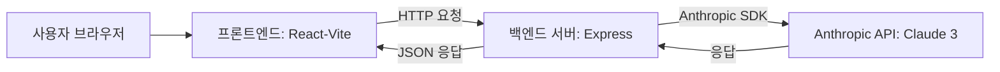

# 시스템 아키텍처

아래 그림은 프런트엔드와 백엔드, 그리고 Anthropic API(Claude 3)가 상호작용하는 흐름을 나타냅니다.



## 컴포넌트 역할

### 프런트엔드
- React와 Tailwind CSS로 구성된 SPA입니다.
- 사용자의 자기소개서, 지원 기업 정보, 면접 답변 등을 입력받아 백엔드 API로 전송합니다.
- 백엔드가 반환한 결과를 화면에 표시하며, 상태 관리를 통해 대시보드 등의 UI를 갱신합니다.

### 백엔드
- Express 기반 서버로 `/api/*` 경로의 REST API를 제공합니다.
- 요청을 받아 필요한 프롬프트를 생성하고 `@anthropic-ai/sdk`를 통해 Anthropic API를 호출합니다.
- 응답 결과를 가공하여 프런트엔드에 JSON 형태로 반환합니다.

### Anthropic API
- Claude 3 모델을 사용하여 자연어 처리를 수행합니다.
- 백엔드에서 전달한 프롬프트에 따라 자기소개서 분석, 면접 질문 생성 등 다양한 작업을 수행한 뒤 결과를 반환합니다.

## GPT 사용 시나리오

### 1. 자기소개서 분석
사용자가 작성한 자기소개서를 업로드하면 `/api/resume/analyze` 엔드포인트를 통해 아래와 같이 프롬프트가 생성됩니다.

```
다음은 {name}님의 자기소개서입니다.
지원 포지션: {position}
경력: {experience}
내용: {resumeContent}

위 자기소개서를 분석하여 다음 항목에 대해 피드백을 제공해주세요:
1. 강점
2. 개선이 필요한 부분
3. 구체적인 개선 제안
4. 전체적인 평가
```

### 2. 자기소개서 작성
특정 키워드를 포함한 자기소개서를 자동으로 작성하고 싶을 때 `/api/resume/generate` 엔드포인트를 이용합니다. 생성되는 프롬프트 예시는 다음과 같습니다.

```
{name}님의 자기소개서를 작성해주세요.
지원 포지션: {position}
경력: {experience}
포함할 키워드: {keywords}

다음 형식으로 작성해주세요:
1. 자기소개
2. 지원 동기
3. 경력 및 프로젝트
4. 향후 목표
```

### 3. 면접 질문 생성
기업과 포지션 정보를 입력하면 `/api/interview/questions`에서 아래와 같은 프롬프트가 전송됩니다.

```
{company} 기업 {position} 포지션 면접 질문을 생성해주세요.
경력: {experience}

다음 카테고리별로 3개씩 질문을 생성해주세요:
1. 기술 관련 질문
2. 프로젝트 경험 관련 질문
3. 상황 대처 관련 질문
4. 커리어 목표 관련 질문

각 질문은 "질문: "으로 시작해주세요.
```

### 4. 면접 답변 피드백
면접 질문과 사용자의 답변을 보내면 `/api/interview/feedback`에서 다음과 같이 프롬프트가 구성됩니다.

```
다음 면접 질문과 답변을 평가해주세요.

질문: {question}
답변: {answer}

다음 항목에 대해 피드백을 제공해주세요:
1. 답변의 장점
2. 개선이 필요한 부분
3. 구체적인 개선 제안
4. 전체적인 평가
```

이러한 시나리오를 통해 사용자는 자기소개서 개선, 면접 준비, 실시간 피드백 등 취업 활동 전반을 AI의 도움으로 수행할 수 있습니다.
